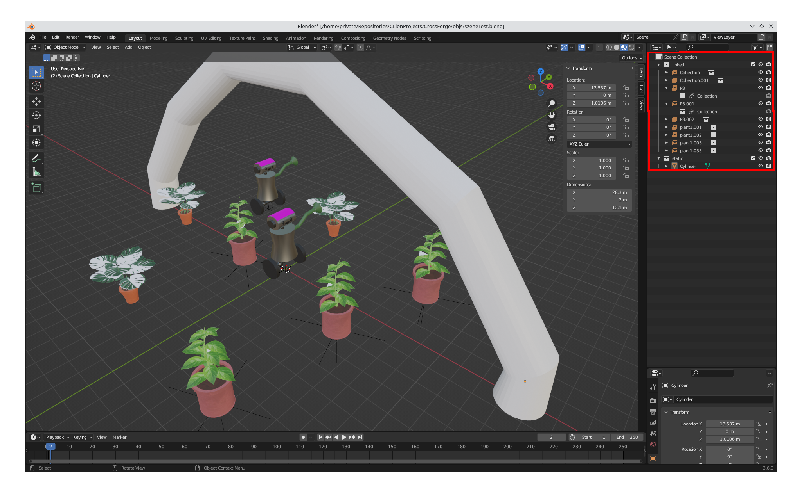

= Blender als Level Editor

== Warum wird überhaupt ein Editor benötigt?

* Hardcoding nicht möglich, weil detailreiche Szenen mit hunderten Objekten nicht Hardcodebar
* Prozedurale platzierung ist Interessant, aber ist ein großes und komplexes Gebiet, was den Rahmen sprengen würde
* selbst Level Editor programmieren ist selbst eine riesige Aufgabe -> Blender genutzt, weil mächtiger 3D Editor, mit Addon-Support, außerdem besteht Erfahrung im Team

== Ansatz 1: Import von GLTF-Dateien

* GLTF ist offenes Format
* Unterstützung für: mehrere Szenen, Lichter, Kameras, Animationen
* GLTF mit Assimp laden
** `aiProcess_OptimizeGraph` deaktivieren, damit Graph nicht modifiziert wird
** Szenengraph rekursiv traversieren, wenn man an Node mit bestimmter Namenskonvention (z.B Regex: `entity-\w-\w`)
** Entity hinzufügen und alles was unter der Node hängt zu einem Modell zusammenfügen
* Vorteile:
** Editor Agnostisch
** Vorhandenes Wissen/Technik nutzen
* Nachteile:
** ziemlich tief in CrossForge änderungen machen, die Projektspezifisch sind
** Korrekte Benennung der Nodes ist relevant
** GLTF-Nodes können nur einen Elternknoten haben -> jedes mal wird gesammter Graph des Modells gespeichert

== Ansatz 2: Addon für Blender schreiben
* Entities werden als Collection in Szene gelinkt
* Addon geht über alle Objekte in der Szene, für gelinkte Collections wird Transformation mit Originaldatei in Szenendatei gespeichert
* Vorteile:
** keine eingriffe ins Engine Innere nötig
** einfache Umsetzung, da Dateiformat selbst bestimmt
* Nachteile:
** export script verändert den Zustand von Blender, wodurch es nach dem exportieren zu unerwarteten Veränderungen kommen kann

== Plugin aktivieren/aktualisieren
* Level Editor-Plugin muss aktiviert werden, indem man:
** Edit -> Preferences -> Add-ons -> Install
** `<Zum CrossForge Projektordner navigieren und im Order `addon/export.py` auswählen>`
** Den Haken bei `Level Editor` setzen, um es zu aktivieren
* Level Editor-Plugin aktualisieren, indem man:
** Edit -> Preferences -> Add-ons
** Level Editor -> Remove
** Neu importieren

== Szene erstellen und exportieren
* Innerhalb von Blender:
** externe `.blend` Datei in Szene mit Collections linken
** alle gelinkten Modelle in eine eigene Collection
** alle neu hinzugefügte Geometrie in eine eigene Collection (Diese muss '_static_' heißen, damit der Export funktioniert)
** 
** Pflanzen und Roboter sind gelinkt, Bogen ist neue Geometrie
* Szene mit `Dropper` nach `Assets/Scene/<SceneName>.json` exportieren
** *Wichtig*: `SceneName.json` muss mit dem Namen der Originaldatei `SceneName.blend` übereinstimmen, weil der Importer erwartet, dass nur die Endung unterschiedlich ist
